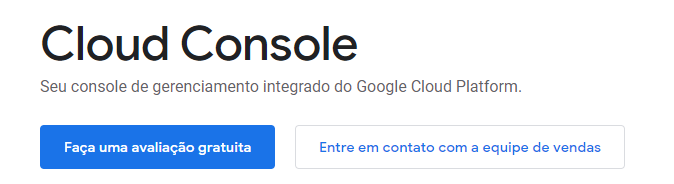
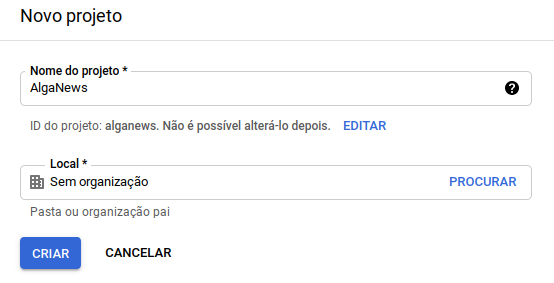
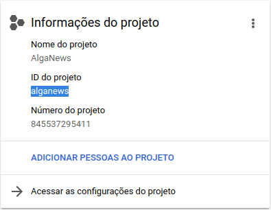
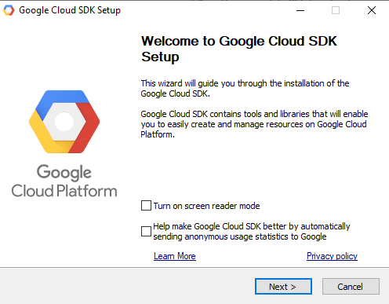
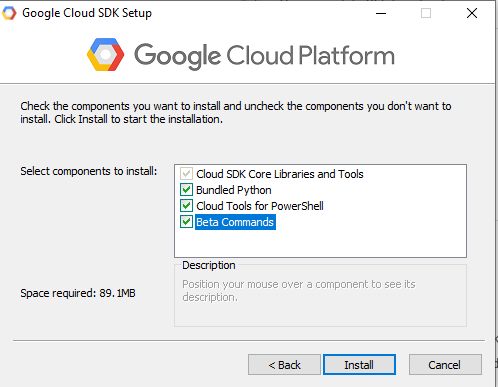
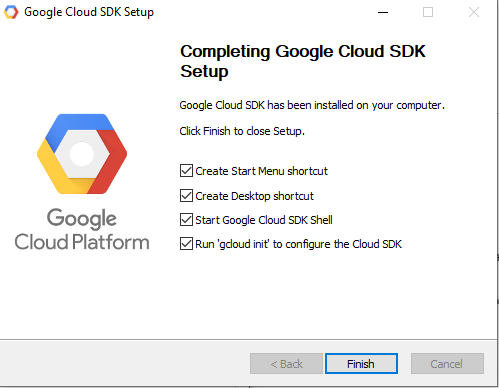
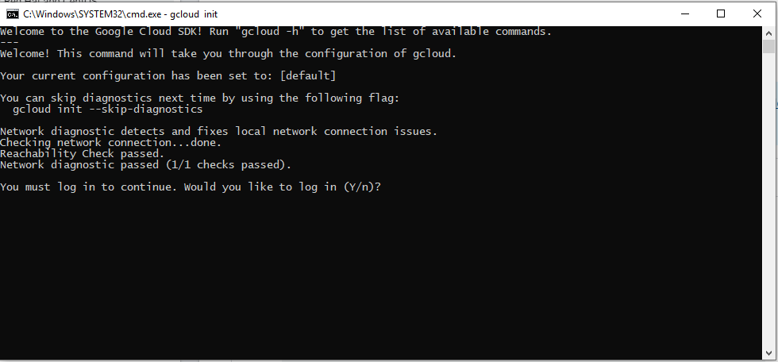
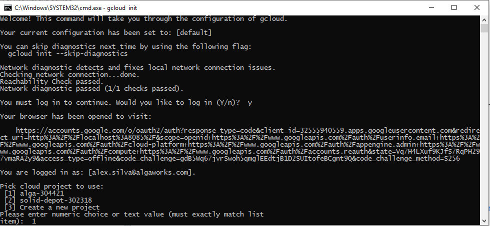
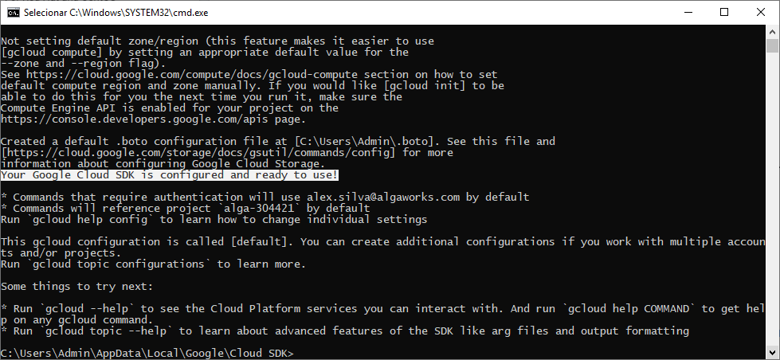

## Preparando o ambiente

Antes de implantar a nossa aplicação, é preciso criar uma conta no Google Cloud Plataform e instalar o Google Cloud SDK, que é uma interface de linha de comando. 

Vamos realizar a instalação e configuração do SDK usando o sistema operacional *Windows* como exemplo.

### Criando uma conta

Acesse [https://cloud.google.com/cloud-console](https://cloud.google.com/cloud-console), clique no botão **Faça uma avaliação gratuita** e prossiga com os passos para criar uma conta.

  

### Acessando o projeto

Depois que estiver logado no GCP, acesse [https://console.cloud.google.com/projectcreate](https://console.cloud.google.com/projectcreate) e insira um nome para criar um novo projeto. Vamos usar o nome **AlgaNews** em nosso projeto.

  

Acesse a página do projeto para conferir o identificador (**ID do projeto**) gerado junto ao nome. Anote ambos em algum lugar, porque vamos utilizar durante todo o processo.

  

### Instalando o SDK no Windows	

Para instalar o SDK, primeiro faça o download em [https://cloud.google.com/sdk/docs/install](https://cloud.google.com/sdk/docs/install).

Em seguida execute arquivo de instalação e clique em **Next**.

  

Ao chegar na tela de componentes de instalação, marque todas as opções, incluindo a opção de instalar comandos que estão em beta (opção *Beta Commands*) e clique em **Install**.

  

Na tela de conclusão, marque todas as opções e clique em **Finish**.

  

Uma tela de prompt de comandos será aberta e irá inicializar o SDK. Digite **Y** e pressione **Enter** para prosseguir com o login.

  

A tela de login irá abrir no navegador. Insira o usuário do console da **GCP** e autorize o aplicativo.

  

De volta ao prompt de comando, digite o número da opção que corresponde ao projeto criado ou selecionado anteriormente. Em seguida, pressione **Enter**.

  

Pronto! O SDK está configurado na sua máquina.

  

#### Referências

- [Google Cloud Docs - Instruções para instalação](https://cloud.google.com/sdk/docs/install#windows)

