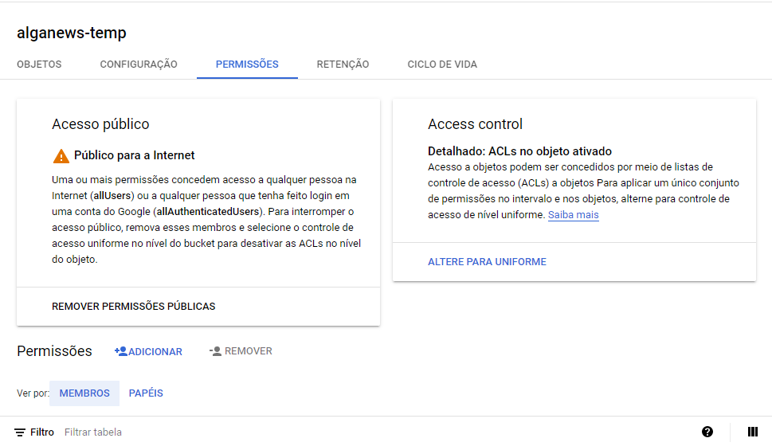

## Configurando o Google Storage

O **Google Storage** é o serviço de armazenamento de arquivos da **GCP**.

Vamos utilizá-lo para armazenar os arquivos de imagens da nossa aplicação, como fotos de usuários e de posts.

Para começar, vamos ativar o serviço na sua conta. Execute os comandos abaixo na sua máquina:

```
gcloud services enable storage-api.googleapis.com
gcloud services enable storage-component.googleapis.com
gcloud services enable storage.googleapis.com
```


### Criando Buckets para armazenamento

Os buckets são como pastas para o armazenamento de arquivos na Google Storage.

Vamos criar dois deles para a nossa aplicação. Um para arquivos **temporários** e outro para arquivos **permanentes**.

Vamos utilizar o programa de linha de comando <code>gsutil</code>, que faz parte do **Google Cloud SDK**, que foi configurado anteriormente.

Abra o prompt de comando e digite a seguinte instrução para criar um bucket:

```
gsutil mb -l REGION gs://BUCKET_NAME
```

Substitua `BUCKET_NAME` pelo nome do bucket e `REGION` pela região desejada, como no exemplo:

```
gsutil mb -l US-CENTRAL1 gs://alganews-images
gsutil mb -l US-CENTRAL1 gs://alganews-temp
```
Recomendamos a utilização da região **US-CENTRAL1** em todo o projeto, devido a falta de disponibilidade de funcionalidades específicas em outras regiões.

O nome do bucket é único em toda a Google Cloud. Se você informar um nome já usado, vai receber um erro similar a mensagem abaixo. Nesse caso, tente usar um novo nome.

*ServiceException: 409 A Cloud Storage bucket named 'alganews-images' already exists. Try another name. Bucket names must be globally unique across all Google Cloud projects, including those outside of your organization.*


#### Referências

- [Google Cloud Docs - Instruções para criação de Bucket](https://cloud.google.com/storage/docs/creating-buckets#storage-create-bucket-console)
- [Google Cloud Docs - Comandos gsutil para buckets](https://cloud.google.com/storage/docs/gsutil/commands/mb)


### Adicionado tempo de exclusão dos arquivos temporários

O bucket temporário deve eliminar arquivos após um dia, ou seja, é um espaço de armazenamento realmente temporário.

Para definir a exclusão automática dos arquivos de um bucket após um dia, crie um arquivo em formato JSON com o seguinte conteúdo:

``` json
{
  "rule": [
    {
      "action": { "type": "Delete" },
      "condition": { "age": 1 }
    }
  ]
}
```

Digite o comando abaixo para enviar a configuração para o bucket:

```
gsutil lifecycle set JSON_FILE_NAME.json gs://BUCKET_NAME
```

Substitua `JSON_FILE_NAME` pelo nome do arquivo JSON e `BUCKET_NAME` pelo nome do bucket. Por exemplo:

```
gsutil lifecycle set lifecycle.json gs://alganews-temp
```


#### Referências

- [Google Cloud Docs - Tempo de vida de um arquivo](https://cloud.google.com/storage/docs/gsutil/commands/lifecycle)


### Definindo acesso público aos Buckets

Com os buckets criados, será necessário habilitar permissão de leitura para todos, deixando-os públicos.

Para isso, utilize o seguinte comando:

```
gsutil iam ch allUsers:objectViewer gs://BUCKET_NAME
```

Substitua `BUCKET_NAME` pelo nome dos buckets. Por exemplo:

```
gsutil iam ch allUsers:objectViewer gs://alganews-images
gsutil iam ch allUsers:objectViewer gs://alganews-temp
```

Acesse a página do serviço do [Google Storage](https://console.cloud.google.com/storage/browser), abra os buckets e verifique se na aba **Permissões** é exibida a mensagem "Público para internet", como na imagem abaixo:

<p style="text-align: center">
  
</p>


#### Referências

- [Google Cloud Docs - Tornando um Bucket público](https://cloud.google.com/storage/docs/access-control/making-data-public)


### Configurando CORS do Bucket

Para aceitar requisições de qualquer tipo (*GET, PUT*) feitas por qualquer origem, crie um arquivo JSON com o seguinte conteúdo:

``` json
[
  {
    "origin": [ "*" ],
    "responseHeader": [
      "Origin", "Accept", "X-Requested-With", "Authorization", 
      "Content-Type", "Content-Length", "Accept-Encoding", "X-CSRF-Token"
    ],
    "method": [ "*" ]
  }
]
```

Utilize o comando para enviar a configuração para o *bucket*:

```
gsutil cors set JSON_FILE_NAME.json gs://BUCKET_NAME
```

Substitua `JSON_FILE_NAME` pelo nome do arquivo JSON e `BUCKET_NAME` pelo nome do bucket. Por exemplo:

```
gsutil cors set cors.json gs://alganews-temp
```

Note que vamos habilitar o CORS apenas no bucket de arquivos temporários.


#### Referências

- [Google Cloud Docs - Ativando CORS no Bucket](https://cloud.google.com/storage/docs/configuring-cors)
