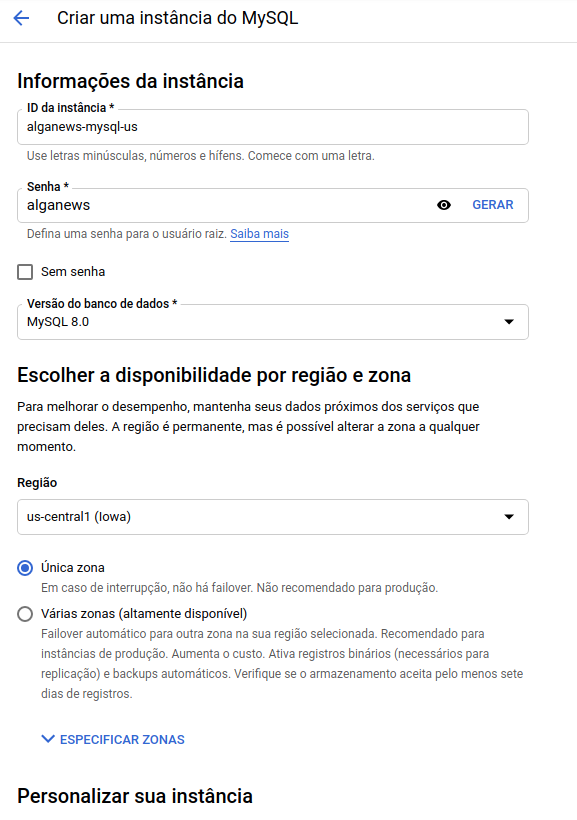
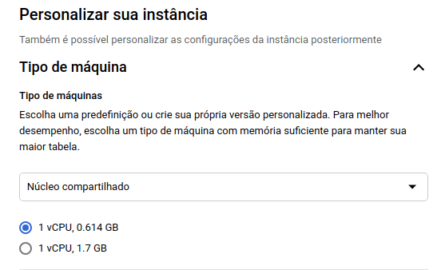
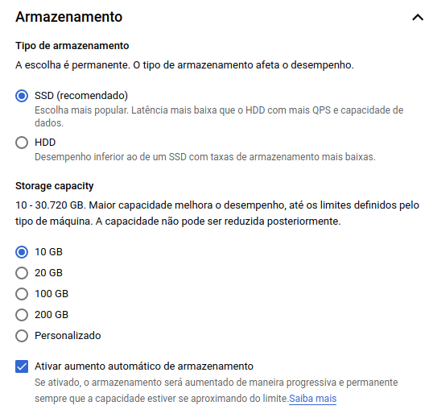
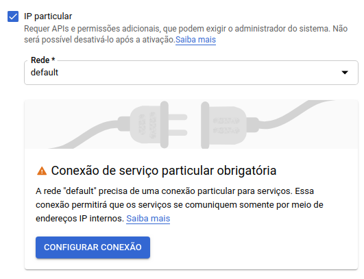
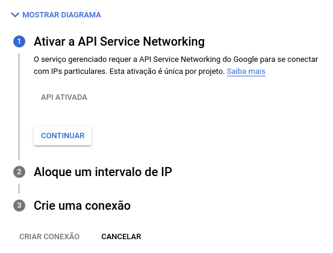
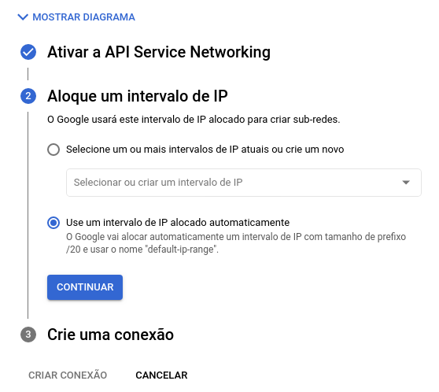
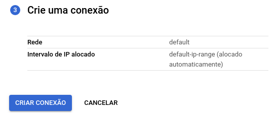
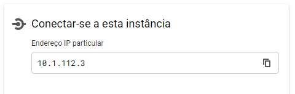

## Configurando o Google Cloud SQL

O **Google Cloud SQL** é um serviço de banco de dados relacional gerenciado. Vamos utilizá-lo para rodar uma instância do MySQL Server.

### Criando uma instância do MySQL

Acesse [https://console.cloud.google.com/sql/choose-instance-engine](https://console.cloud.google.com/sql/choose-instance-engine) para ativar o serviço. Em seguida, escolha a opção **MySQL**.

Preencha o formulário com as seguintes informações: 

- Nome (ID) da instância do banco 
- Senha do usuário *root* (administrador do banco de dados)
- Versão 8 do MySQL
- Região *us-central1* (ou a região desejável)
- Zona Única

Confira o preenchimento na imagem abaixo:

  

Clique em **Mostrar Opções de Configuração** e vá para o menu **Tipo de máquina**.

Selecione a opção **Núcleo compartilhado**, como na imagem:

  

Acesse o menu **Armazenamento**.

Selecione a opção **SSD** e **10 GB**, como na imagem:

  

Acesse o menu **Conexões**. 

Selecione a opção **IP particular** e rede **default**. Em seguida, clique em **Configurar conexão**.

  

No menu **Ativar a API Service Networking**, a ative o serviço de rede.

  

No menu **Aloque um intervalo de IP**, selecione a opção **Use um intervalo de IP alocado automaticamente**. Em seguida, clique em **Continuar**.

  

No menu **Crie uma conexão**, confira as informações e clique em **Criar conexão**.

  

Após alocar um IP particular, para iniciar o processo de criação do banco, clique em **Criar Instância**.

Após o processo de criação, na tela de **Visão geral** da instância, aguarde pela conclusão do processo. Ao finalizar, procure a sessão **Conectar-se a esta instância** e localize o IP particular:

  

Este IP particular será utilizado pela aplicação para se conectar com o banco de dados. Anote ele.

#### Referências

- [Google Cloud Docs - Configurando serviços](https://cloud.google.com/endpoints/docs/openapi/enable-api)
- [Google Cloud Docs - Configurando serviço de rede](https://cloud.google.com/service-infrastructure/docs/service-networking/getting-started)
- [Google Cloud Docs - Configurando MySQL no Cloud SQL](https://cloud.google.com/sql/docs/mysql/create-instance?hl=pt-br#gcloud)
- [Google Cloud Docs - Configurando IP particular no Cloud SQL](https://cloud.google.com/sql/docs/mysql/configure-private-ip)
- [Google Cloud Docs - Liberando acesso de administrador de rede](https://cloud.google.com/vpc/docs/configure-private-services-access?_ga=2.116920390.-1154345941.1611166837&_gac=1.255025786.1617884459.CjwKCAjw07qDBhBxEiwA6pPbHl_ct7aZauhsd1QYuqMHVftEsxjv_O3xMPtwRL30CXFeI7OLNRdG7BoCfVkQAvD_BwE)
