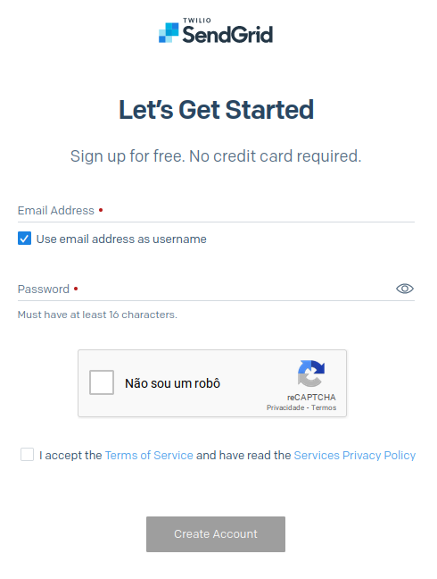
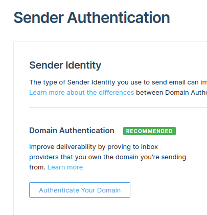
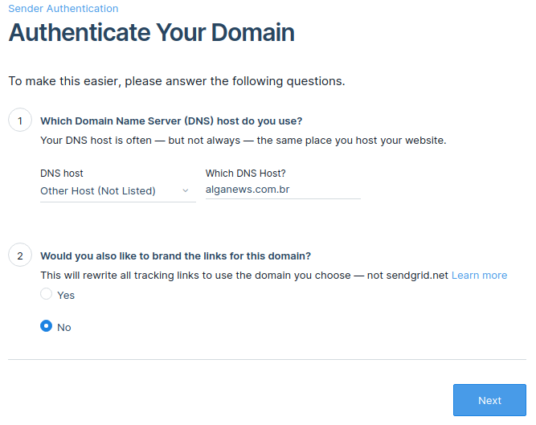
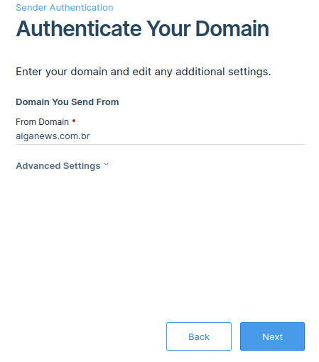
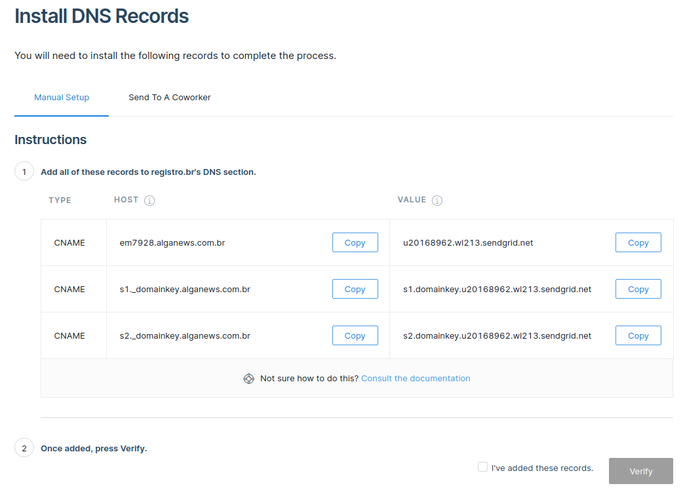
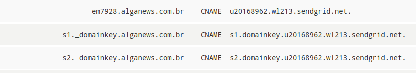
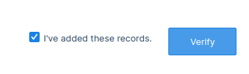
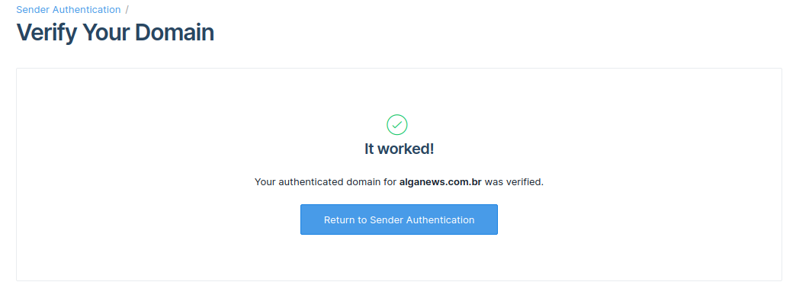
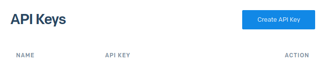
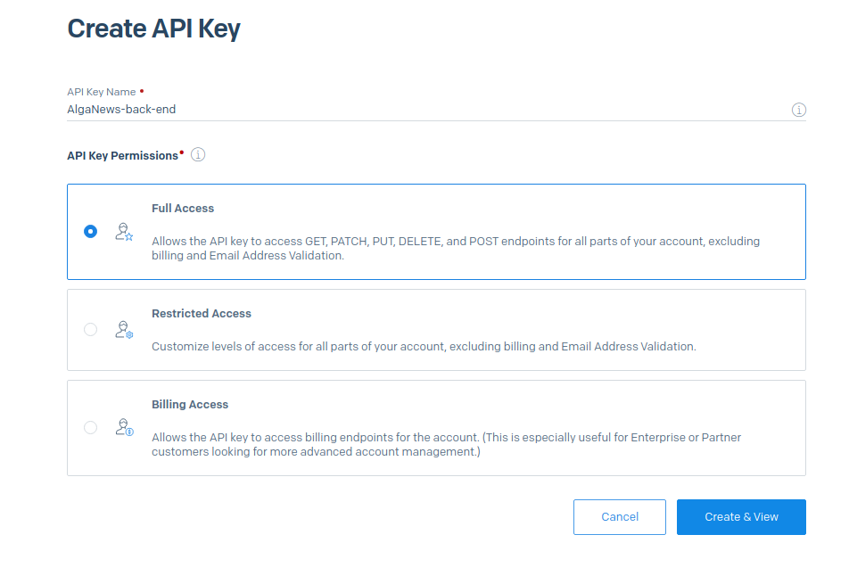

## Configurando o SendGrid

O **SendGrid** é um serviço para o envio de e-mails transacionais e de marketing.

Além de bem simples, ele possui um plano gratuito para testes. Acesse [https://signup.sendgrid.com](https://signup.sendgrid.com) para criar uma conta gratuitamente.

  

Agora é preciso autenticar o domínio que será utilizado como remetente. Para isso, acesse o painel [Sender Authentication](https://app.sendgrid.com/settings/sender_auth) e clique em **Authenticate Your Domain**.

  

No primeiro item, **Which Domain Name Server (DNS) host do you use?**, informe o provedor onde o seu domínio está registrado. Se ele não estiver na lista, informe **Other Host (Not Listed)**.

Em **Which DNS Host?**, informe a URL do seu provedor. No nosso caso, informamos **Registro.br**.

No segundo item, **Would you also like to brand the links for this domain?**, mantenha a opção **No** selecionada e clique em **Next**.

  

Em **Domain You Send From**, informe o domínio que será utilizado como remetente do e-mail. No nosso caso, usamos *alganews.com.br*.

Para prosseguir, clique em **Next**.

  

Serão exibidos registros de DNS do tipo CNAME a serem configurados. Mantenha a tela aberta, pois vamos utilizá-la em seguida.

  

Abra o painel de configuração de Zona de DNS do seu provedor e insira os registros exibidos na tela anterior. No nosso caso, estamos usando o Registro.br, portanto adicionamos as entradas como você pode ver abaixo:

  

Volte na tela do SendGrid, selecione a opção **I've added these records** e clique em **Verify**.

Importante: Se a verificação falhar, tente novamente dentro de alguns minutos, por conta da propagação do DNS estar sendo realizada.

  

Feito a verificação, a tela de sucesso será exibida.

  

Agora precisamos gerar uma chave de API para o nosso back-end. Acesse a [listagem de chaves](https://app.sendgrid.com/settings/api_keys) e em seguida clique em **Create API Key**.

  

Adicione um nome qualquer para a chave, selecione a opção **Full Access** e em seguida clique em **Create & View**. 

Copie a chave gerada e guarde em um local seguro, porque vamos usá-la mais a frente.

  

#### Referências

- [Documentação do SendGrid](https://docs.sendgrid.com/)
