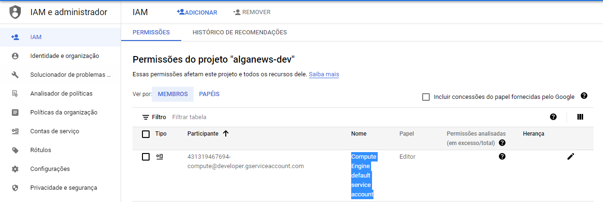
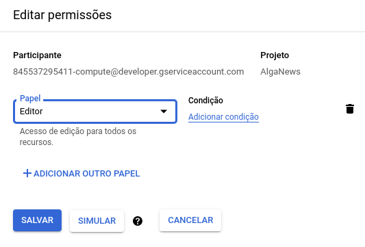
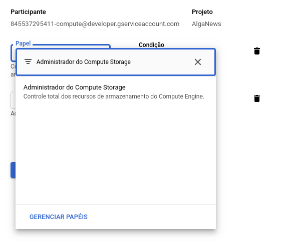
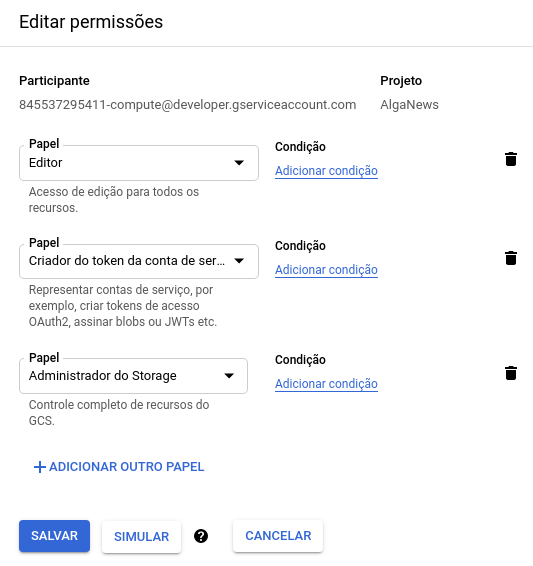

## Deploy de containers no Cloud Run

Agora nós vamos fazer deploy de containers Docker das aplicações da REST API e Authorization Server do AlgaNews.

Vamos usar o Cloud Run, que é um serviço sem servidor (*serverless*) para implantação de containers altamente escalonáveis e totalmente gerenciados pela Google.


### Ativando o Container Registry

Para começar, vamos ativar o serviço de *Container Registry* do GCP na sua conta, que é onde serão armazenadas as imagens Docker.

Execute o comando abaixo na sua máquina:

```
gcloud services enable containerregistry.googleapis.com
```

Acesse a listagem de imagens do projeto no *Container Registry* ([https://console.cloud.google.com/gcr/images/alganews](https://console.cloud.google.com/gcr/images/alganews)) e confira se o serviço foi ativado.

Agora, autentique o serviço do Docker para poder enviar as imagens ao GCP, digitando o comando abaixo na sua máquina:

```
gcloud auth configure-docker
```


### Baixando a imagem do Docker

Vamos baixar as imagens Docker da REST API e Authorization Server para nossa máquina local. Digite os comandos abaixo:

```
docker pull algaworks/alganews-auth-server:latest 
docker pull algaworks/alganews-api:latest 
```

Atribua novas *tags* às imagens, referenciando o seu projeto na GCP:

```
docker tag algaworks/alganews-auth-server:latest ^
gcr.io/PROJECT_ID/alganews-auth:latest

docker tag algaworks/alganews-api:latest ^
gcr.io/PROJECT_ID/alganews-api:latest
```

Substitua `PROJECT_ID` pelo identificador do seu projeto. Por exemplo:

```
docker tag algaworks/alganews-auth-server:latest ^
gcr.io/alganews/alganews-auth:latest

docker tag algaworks/alganews-api:latest ^
gcr.io/alganews/alganews-api:latest
```


### Enviando as imagens para o Container Registry

Execute os comandos abaixo para enviar as imagens ao *Container Registry* do projeto no GPC:

```
docker push gcr.io/PROJECT_ID/alganews-api:latest
docker push gcr.io/PROJECT_ID/alganews-auth:latest
```

Substitua **PROJECT_ID** pelo identificador do seu projeto. Por exemplo:

```
docker push gcr.io/alganews/alganews-api:latest
docker push gcr.io/alganews/alganews-auth:latest
```


#### Referências

 - [Google Cloud Docs - Container Registry](https://cloud.google.com/container-registry/docs/quickstart?hl=pt-br)
 - [Google Cloud Docs - Autenticando Docker](https://cloud.google.com/container-registry/docs/advanced-authentication?hl=pt-br)


### Implantando os containers no Cloud Run

Antes de iniciar, será necessário ativar alguns serviços na sua conta. Digite os comandos abaixo:

```
gcloud services enable run.googleapis.com
gcloud services enable iam.googleapis.com
gcloud services enable cloudresourcemanager.googleapis.com
gcloud services enable sqladmin.googleapis.com
```

Acesse a interface do serviço Cloud Run ([https://console.cloud.google.com/run](https://console.cloud.google.com/run)) e confira se ele foi ativado.

Para fazer o deploy de cada uma das aplicações, será necessário ter em mãos diversas informações que foram geradas nos capítulos anteriores, como por exemplo:

 - IP particular do banco de dados
 - Usuário e senha do banco de dados
 - Token da API do SendGrid e um e-mail de remetente no domínio configurado (exemplo: *donotreply@alganews.com.br*)
 - Domínios que serão usados nas aplicações de front-end do CMS e Admin (exemplo: *cms.alganews.com.br* e *admin.alganews.com.br*)
 - Domínios que serão usados para o Authorization Server e REST API (exemplo: *auth.alganews.com.br* e *api.alganews.com.br*)
 - Nomes dos buckets do Google Storage (exemplo: *alganews-images* e *alganews-temp*)
 - Chave para assinatura do Token JWT (você pode inventar uma agora)
 - Dentre outras

Essas informações serão passadas como variáveis de ambiente durante o processo de deploy dos containers, dentro de arquivos YAML de cada aplicação. Estes arquivos descrevem as configurações das aplicações que vamos implantar no Cloud Run.

Nós já disponibilizamos dois *templates* desses arquivos para simplificar a sua vida, sendo um para cada aplicação.

Baixe e edite os arquivos [api.yaml](https://github.com/algaworks/alganews-gcp-setup/blob/main/api.yaml) e [auth.yaml](https://github.com/algaworks/alganews-gcp-setup/blob/main/auth.yaml) e substitua `PROJECT_ID` pelo identificador do seu projeto no GPC.

Ainda na edição dos arquivos, encontre a sessão `env` e preencha as variáveis de ambiente.

Veja abaixo uma lista das variáveis de ambiente:

- **ALGANEWS_AUTH_URL**                                    
  - URL base do Authorization Server, usada em links de e-mails    
  - Por exemplo: https://auth.alganews.com.br      
  - Nota: Você já precisa ter registrado seu domínio na internet nesse ponto ou pelo menos ter definido qual domínio será usado no projeto para configurar essa e outras URLs aqui.
  
- **ALGANEWS_EMAIL_FROM**
  - Remetente dos e-mails da plataforma
  - Por exemplo: AlgaNews \<donotreply@alganews.com.br\>

- **ALGANEWS_AUTH_CLIENTS_ADMIN_CALLBACK_URLS**
  - URLs aceitas de callback do OAuth2 do cliente de front-end Admin
  - Por exemplo: https://admin.alganews.com.br/authorize

- **ALGANEWS_AUTH_CLIENTS_CMS_CALLBACK_URLS**
  - URLs aceitas de callback do OAuth2 do cliente de front-end CMS
  - Por exemplo: https://cms.alganews.com.br/authorize

- **ALGANEWS_AUTH_TOKENS_SIGNING_KEY**
  - Chave de assinatura do token JWT utilizada pelo Authorization Server
  - Por exemplo: <br/>7EoTQsw6$KycR&B9q4YAMPCss!!F6fE4FqNv!B2vEz

- **ALGANEWS_SECURITY_RESOURCE_SERVER_TOKENS_SIGNING_KEY**
  - Chave de assinatura do token JWT utilizada pelo Resource Server
  - Por exemplo: <br/>7EoTQsw6$KycR&B9q4YAMPCss!!F6fE4FqNv!B2vEz
  - Nota: Deve possuir o mesmo valor da variável `ALGANEWS_AUTH_TOKENS_SIGNING_KEY`
  
- **ALGANEWS_STORAGE_PHOTOS_BUCKET**
  - Nome do bucket de imagens permanentes
  - Por exemplo: alganews-images

- **ALGANEWS_STORAGE_TEMP_BUCKET**
  - Nome do bucket de arquivos temporários, usado para upload
  - Por exemplo: alganews-temp

- **ALGANEWS_STORAGE_GCP_DOWNLOAD_URL**
  - URL pública do bucket de arquivos permanentes
  - Por exemplo: https://images.alganews.com.br ou https://storage.googleapis.com/alganews-images

- **ALGANEWS_STORAGE_GCP_UPLOAD_URL**
  - URL pública do bucket de arquivos temporários
  - Por exemplo: https://temp.alganews.com.br ou https://storage.googleapis.com/alganews-temp

- **ALGANEWS_SECURITY_LOGOUT_DEFAULT_REDIRECT_URL**
  - URL de redirect padrão do logout
  - Por exemplo: https://alganews.com.br

- **CLOUD_SQL_CONNECTION_NAME**
  - IP particular do banco de dados
  - Por exemplo: 10.1.112.3

- **DB_USER**
  - Usuário do banco de dados
  - Por exemplo: root

- **DB_PASS**
  - Senha do banco de dados                                        
  - Por exemplo: alganews

- **DB_NAME**
  - Nome do schema do banco de dados
  - Por exemplo: alganews

- **SPRING_MAIL_PASSWORD**
  - Token da API do SendGrid
  - Por exemplo: SG.XDT4sdad.5g3ffaa4

- **SPRING_PROFILES_ACTIVE**
  - Nome do Spring Profile a ser ativado na execução da aplicação
  - Por exemplo: production

- **SPRING_FLYWAY_LOCATIONS**
  - Local dos scripts de migração do banco de dados
  - Por exemplo: classpath:db/migration

Na variável `SPRING_FLYWAY_LOCATIONS`, adicione o valor `classpath:db/testdata`, separando por vírgula, para inserir massa de dados de teste.

Por exemplo: `classpath:db/migration,classpath:db/testdata`.

Sempre que a aplicação/container for iniciado, os dados do banco de dados serão renovados. Se você quiser evitar isso, apenas remova `classpath:db/testdata` do valor da variável e mantenha somente `classpath:db/migration`.

Após o preenchimento das variáveis, para realizar o deploy da aplicação da REST API, utilize o arquivo *api.yaml* no comando:

```
gcloud beta run services replace --region=us-central1 --platform=managed api.yaml
```

E para a aplicação do Authorization Server, utilize o arquivo *auth.yaml* no comando:

```
gcloud beta run services replace --region=us-central1 --platform=managed auth.yaml
```

Ao fazer isso, o container com a aplicação será executado pelo Cloud Run.

Para permitir o tráfego público (web) para essas aplicações, execute os comandos:

```
gcloud run services add-iam-policy-binding alganews-auth --member="allUsers" ^
--region=us-central1 --platform=managed --role="roles/run.invoker" 

gcloud run services add-iam-policy-binding alganews-api --member="allUsers"  ^
--region=us-central1 --platform=managed --role="roles/run.invoker" 
```


### Permitindo a geração de URL pré-autenticada 

É necessário adicionar a permissão de gerenciador do Google Storage para a conta de serviço utilizada pelas aplicações, para que elas possam armazenar arquivos e criar **URLs pré-autenticadas**, usadas para realizar o upload de arquivos a partir de aplicações de front-end.

Acesse a interface do **IAM & Admin** ([https://console.cloud.google.com/iam-admin](https://console.cloud.google.com/iam-admin)) e selecione o projeto **AlgaNews**.

Encontre a conta de serviço de nome **Compute Engine default service account** ou **Default compute service account**:

<p style="text-align: center">
  
</p>

Clique no ícone **Editar membro** (ícone do lápis) correspondente à linha localizada. Um painel suspenso será exibido para edição de permissões.

<p style="text-align: center">
  
</p>

Clique no link **Adicionar outro papel** e adicione as seguintes permissões, uma por vez: 

- *Administrador do Compute Storage*
- *Criador do Token da conta de serviço*

<p style="text-align: center">
  
</p>

Clique no botão **Salvar** para finalizar.

<p style="text-align: center">
  
</p>
