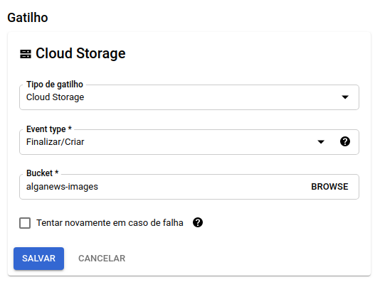
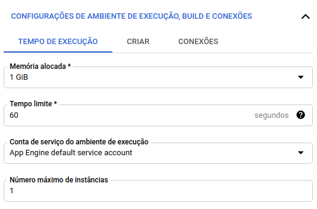
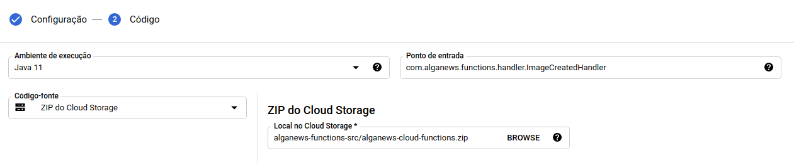
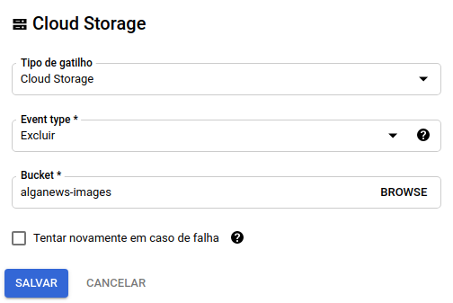
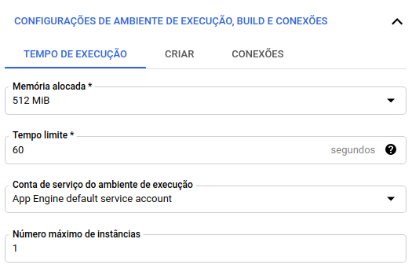
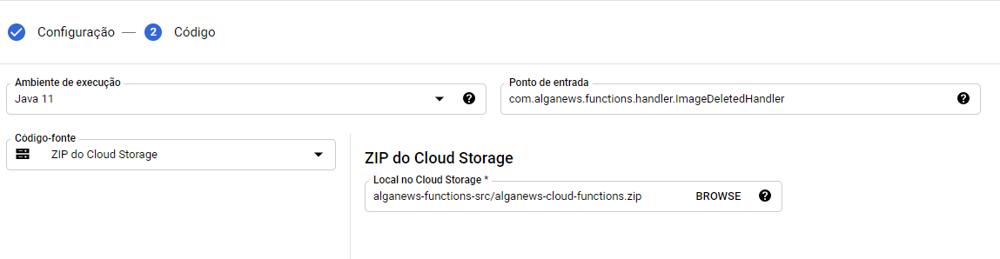

## Deploy de funções serverless no Cloud Functions

O projeto AlgaNews possui funções que geram versões redimensionadas das imagens que os usuários fazem upload através das aplicações de front-end.

Essas funções rodam no Google Cloud Functions, uma plataforma de computador sem servidor (*serverless*).

Para começar, faça download do [arquivo ZIP das funções](https://github.com/algaworks/alganews-gcp-setup/raw/main/alganews-cloud-functions.zip) que faremos deploy.


### Enviando o código-fonte para um Bucket

Vamos criar um bucket no Google Storage para armazenar o código-fonte das funções. Digite o comando abaixo:

```
gsutil mb -l US-CENTRAL1 gs://alganews-functions-src
```

Agora faça upload do arquivo ZIP para o bucket, executando o comando a seguir na pasta onde o arquivo está localizado:

```
gsutil cp NOME_DO_ZIP gs://BUCKET
```

Substitua o `NOME_DO_ZIP` pelo nome do arquivo e `BUCKET` pelo nome do seu bucket. Por exemplo:

```
gsutil cp alganews-cloud-functions.zip gs://alganews-functions-src
```


### Implantando a função de redimensionamento de imagens

Antes de iniciar, será necessário ativar o serviço de Cloud Functions na sua conta. Digite o comando abaixo:

```
gcloud services enable cloudbuild.googleapis.com
```

Acesse a interface do Cloud Functions ([https://console.cloud.google.com/functions/list](https://console.cloud.google.com/functions/list)), selecione o projeto do AlgaNews e clique na opção **Criar função**.

Na tela de configuração, adicione um nome para a função, como por exemplo *alganews-image-resize*.

Na sessão **Gatilho**, selecione as opções:

- **Tipo de gatilho**: Cloud Storage 
- **Event type**: Finalizar/Criar
- **Bucket**: selecione o Bucket de arquivos permanentes (exemplo: *alganews-images*)

<p style="text-align: center">
  
</p>

Ao finalizar, clique em **Salvar** para aplicar as configurações de gatilho.

Na sessão **Configurações de Ambiente**, informe as opções:

- **Memória alocada**: 1GB (a quantidade e RAM é alta devido ao processamento de imagens)
- **Tempo limite**: 60
- **Número máximo de instâncias**: 1

<p style="text-align: center">
  
</p>

Em seguida, clique em **Próxima**.

Na tela de código, informe as opções:

 - **Ambiente de execução**: Java 11
 - **Ponto de entrada**: `com.alganews.functions.handler.ImageCreatedHandler`
 - **Código-fonte**: selecione **ZIP do Cloud Storage** e em seguida localize o Bucket recém criado e o arquivo ZIP

<p style="text-align: center">
  
</p>

Ao concluir, clique em **Implantar**.


#### Referências

 - [Deploy das funções no Google Cloud Functions](https://cloud.google.com/functions/docs/deploying/filesystem?hl=pt-br)
 - [Upload de arquivos](https://cloud.google.com/storage/docs/uploading-objects#gsutil)
 - [Deploy function Java](https://cloud.google.com/functions/docs/quickstart-java?hl=pt-br)


### Deploy da função de remoção das imagens

Acesse a interface do [Cloud Functions](https://console.cloud.google.com/functions/list) novamente e clique em **Criar função**.

Na tela de configuração, adicione um nome para a função, como por exemplo *alganews-image-remove*.

Na sessão **Gatilho**, selecione as opções:

- **Tipo de gatilho**: Cloud Storage 
- **Event type**: Excluir
- **Bucket**: selecione o Bucket de arquivos permanentes (exemplo: *alganews-images*)

<p style="text-align: center">
  
</p>

Ao finalizar, clique em **Salvar** para aplicar as configurações de gatilho.

Na sessão **Configurações de Ambiente**, informe as opções:


- **Memória alocada**: 512MB
- **Tempo limite**: 60
- **Número máximo de instâncias**: 1

<p style="text-align: center">
  
</p>

Em seguida, clique em **Próxima**.

Na tela de código, informe as opções:

 - **Ambiente de execução**: Java 11
 - **Ponto de entrada**: `com.alganews.functions.handler.ImageDeletedHandler`
 - **Código-fonte**: selecione **ZIP do Cloud Storage** e em seguida localize o Bucket recém criado e o arquivo ZIP

<p style="text-align: center">
  
</p>

Ao concluir, clique em **Implantar**.
