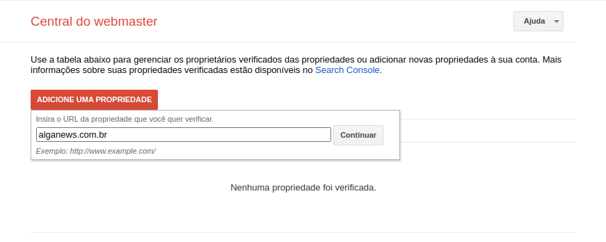

## Verificando um domínio personalizado

Antes de usar um domínio personalizado nas aplicações e serviços de back-end do nosso projeto, é necessário verificá-lo dentro da Google Cloud, para conferir a propriedade do domínio.

Nesse momento você já deve ter o seu domínio registrado na internet. Você pode aprender como fazer isso em uma aula do **Especialista React**, dentro da plataforma de estudos.

Dito isso, para verificar o domínio, acesse a **Central do webmaster** ([https://www.google.com/webmasters/verification/home?hl=pt-BR](https://www.google.com/webmasters/verification/home?hl=pt-BR)) e clique em **Adicione uma propriedade**.

Em seguida informe o domínio que deseja utilizar e clique em **Continuar**. No nosso caso, vamos usar o domínio *alganews.com.br*.

  

Na aba **Método recomendado**, selecione o seu provedor de domínio. Se ele não estiver na lista, selecione a opção **Outro**. No nosso caso, usamos o provedor Registro.br, e como ele não está na lista, vamos utilizar essa opção.

  

Um registro do tipo **TXT** que precisa ser adicionado no seu servidor DNS será exibido. Mantenha a **Central do webmaster** aberta e copie esse registro, porque vamos usá-lo em seguida.

  

Acesse o gerenciamento do seu servidor de DNS e adicione um registro do tipo **TXT** informando como valor o que você copiou no passo anterior. 

Como estamos o servidor DNS do própiro Registro.br, deixamos como na imagem abaixo.

  

  

Volte na **Central do webmaster** e clique em **Verificar**.

Se a verificação falhar, tente novamente após alguns minutos para aguardar a propagação da alteração.

  

#### Referências
- [Como verificar o nome de domínio](https://cloud.google.com/endpoints/docs/openapi/verify-domain-name?hl=pt-br)
