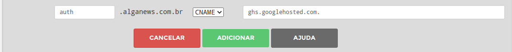

## Configurando domínios personalizados nas aplicações

Agora nós vamos configurar as aplicações da REST API e Authorization Server para torná-las acessíveis através da internet usando um domínio personalizado.

No nosso caso, o domínio registrado é o *alganews.com.br*.

### Configurando um domínio na REST API

Para adicionar domínios personalizados nas aplicações de back-end, acesse o painel de gerenciamento de domínios do Google Cloud ([https://console.cloud.google.com/run/domains](https://console.cloud.google.com/run/domains)) e clique em **Adicionar mapeamento**.

  

Selecione o serviço para mapear e escolha um domínio verificado. No nosso caso, selecionamos *alganews.com.br*.

Especifique um subdomínio, como por exemplo **api** para a REST API.

Para prosseguir, clique em **Continuar**.

  

Um registro do tipo **CNAME** que precisa ser adicionado no seu servidor DNS será exibido. Mantenha a tela aberta e copie esse registro, pois vamos usá-lo em seguida.

  

No seu servidor DNS e adicione um registro do tipo **CNAME** com o valor copiado no passo anterior.

No nosso caso, usamos o servidor DNS do Registro.br e deixamos como na imagem abaixo:

  

  

Volte ao painel de **gerenciamento de domínios** e clique em **Concluído**. 

### Configurando um domínio no Authorization Server

Agora, para configurar o domínio customizado na aplicação de Authorization Server, vamos repetir o mesmo passo a passo anterior.

No painel de gerenciamento de domínios, clique em **Adicionar mapeamento**.

Especifique um subdomínio, como por exemplo **auth** e clique em **Continuar**.

  

Um registro do tipo **CNAME** que precisa ser adicionado no seu servidor DNS será exibido. Mantenha a tela aberta e copie esse registro, pois vamos usá-lo em seguida.

  

No seu servidor DNS e adicione um registro do tipo **CNAME** com o valor copiado no passo anterior.

No nosso caso, usamos o servidor DNS do Registro.br e deixamos como na imagem abaixo:

  

  

Volte ao painel de **Gerenciamento de domínios** e clique em **Concluído**.

Você pode precisar aguardar alguns minutos ou até horas para a propagação dessas alterações no servidor DNS.

Quando isso acontecer, a lista no painel de gerenciamento de domínios ficará como na imagem abaixo.

  

#### Referências

- [Como verificar o nome de domínio](https://cloud.google.com/endpoints/docs/openapi/verify-domain-name?hl=pt-br)
