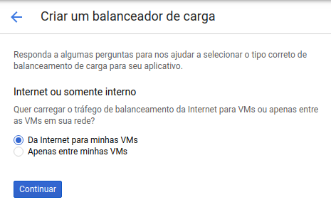
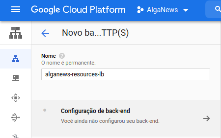
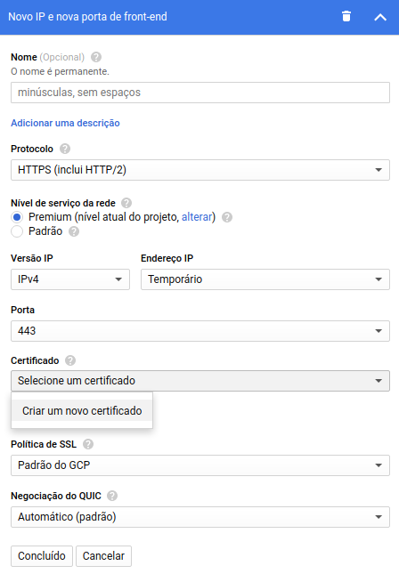

## Configurando domínios personalizados nos Buckets

Para mapear domínios personalizados aos buckets do Google Storage, será necessário criar um balanceador de carga (*load balancer*).

Ative o serviço do balanceador de cargas acessando [https://console.cloud.google.com/marketplace/details/google-cloud-platform/cloud-load-balancing](https://console.cloud.google.com/marketplace/details/google-cloud-platform/cloud-load-balancing).

### Criando um balanceador de carga

No menu da interface do serviço, clique em **Criar balanceador de carga**.

  

Na sessão **Balanceamento de carga HTTPS**, clique em **Iniciar configuração**.

  

Selecione a opção **Da Internet para minhas VMs** para criar um balanceador de carga acessível da Internet.

  

Adicione um nome ao balanceador de carga, como por exemplo *alganews-resources-lb*. Depois clique em **Configuração de back-end**.

  

Em **Serviços de buckets de back-end**, selecione a opção **Criar um bucket de back-end**.

  

Adicione um nome ao back-end do bucket, como por exemplo *alganews-images-backend* e selecione o bucket de imagens permanentes (no nosso caso, *alganews-images*).

Para finalizar clique em **Criar**.

  

Repita o mesmo passo para para configurar um back-end para o bucket de arquivos temporários, deixando como na imagem abaixo:

  

Agora vamos adicionar os subdomínios para cada um dos buckets. Clique em **Regra de host e de caminho**.

  

No campo **Hosts**, informe o subdomínio desejado para cada um dos buckets.

Clique em **Adicionar regra de host e de caminho** para adicionar mais uma entrada na lista.

Em **Caminhos**, informe `/*` para mapear a partir da raiz do subdomínio.

No nosso caso, adicionamos os subdomínios *images.alganews.com.br* e *temp.alganews.com.br*, para os buckets de arquivos permanentes e temporários, respectivamente. 

A primeira entrada de host (ou entrada padrão), pode ser mantida em qualquer um dos buckets, não fará diferença na nossa configuração.

  

Agora vamos adicionar a configuração de HTTP do nosso Load Balancer. Para isso, clique em **Configuração de front-end**.

  

Altere o protocolo para **HTTPS** e na caixa de seleção **Certificado**, clique em **Criar um novo certificado**.

  

Adicione um nome ao certificado. No nosso caso, definimos o nome *alganews-https-cert-bucket*.

Selecione a opção **Criar um certificado gerenciado pelo Google** e informe os domínios dos buckets. Para finalizar, clique em **Criar**.

  

Selecione o certificado criado e clique em **Concluído**.

  

Acesse a opção **Analisar e finalizar**.

  

Verifique se as informações estão corretas e clique no botão **Criar**. Aguarde a criação do balanceador de carga.

  

### Configurando domínios personalizados ao balanceador de carga

Na listagem dos balanceadores de carga, clique no balanceador criado para acessar os detalhes dele.

Encontre e copie o IP atribuído, porque vamos usá-lo em seguida.

  

No seu servidor DNS, adicione um registro do tipo **A** para cada um dos endereços dos buckets.

Como estamos usando o servidor DNS do Registro.br, deixamos da seguinte forma:

  

Após a configuração no seu servidor de DNS, o certificado HTTPS se torna válido.

Você pode consultar o certificado nos detalhes do balanceador de carga.

  

Pronto! As aplicações e serviços de back-end do AlgaNews devem estar rodando na nuvem da Google e acessíveis através de domínio personalizado.

Agora você pode testar a REST API por algum aplicativo (como o Postman) ou ainda integrar as suas aplicações de front-end ao back-end.

